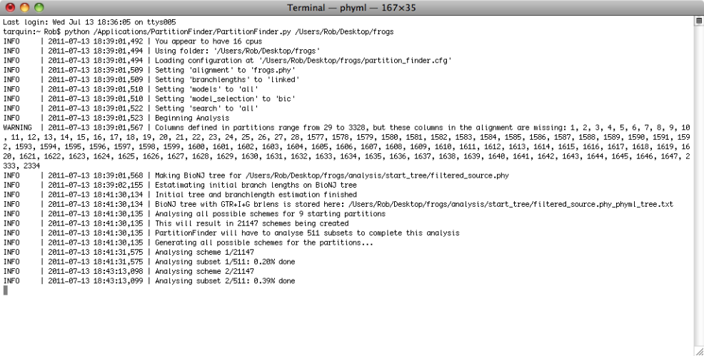
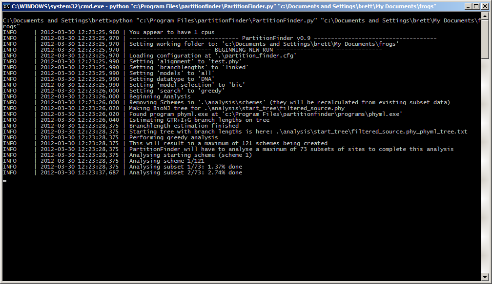

# PartitionFinder2

Rob Lanfear, August 2015

Icon © Ainsley Seago. Thanks Ainsley!

**Questions, suggestions, problems, bugs?** Search on or post in the discussion group at: <http://groups.google.com/group/partitionfinder>

**Step-by-step tutorial**: <http://www.robertlanfear.com/partitionfinder/tutorial/>

**FAQs**: <http://www.robertlanfear.com/partitionfinder/faq/>

**Citations**

PartitionFinder2 incorporates many years of hard work from many people,
presented in various different papers. Citations are the only way that
we know people are using our methods, and are all we have to demonstrate
to funders that the methods are useful. So if you use PartitionFinder2
in your published work please cite the appropriate papers (there will
often be more than one). The correct citations are listed in the
‘Citations’ section below, and will also included in the program's
output.

## Disclaimer

*Copyright (C) 2011-2015 Robert Lanfear, Paul Frandsen, and Brett Calcott*

*This program is free software: you can redistribute it and/or modify it
under the terms of the GNU General Public License as published by the
Free Software Foundation, either version 3 of the License, or (at your
option) any later version. This program is distributed in the hope that
it will be useful, but WITHOUT ANY WARRANTY; without even the implied
warranty of MERCHANTABILITY or FITNESS FOR A PARTICULAR PURPOSE. See the
GNU General Public License for more details. You should have received a
copy of the GNU General Public License along with this program. If not,
see <http://www.gnu.org/licenses/>. PartitionFinder also includes
the PhyML program and the RAxML program, using PartitionFinder implies
that you agree with those licences and conditions as well.*

## What PartitionFinder2 is for

PartitionFinder2 is a
program for selecting best-fit partitioning schemes and models of
evolution for nucleotide, amino acid, and morphology alignments. The
user provides an alignment, and optionally some pre-defined data blocks
(e.g. 9 data blocks defining the 1st, 2nd and 3rd codon positions
of 3 protein-coding genes, see Figure 1). The program then finds the
best partitioning scheme for this dataset, at the same time as selecting
best-fit models for each subset of sites/columns. Here are a few things
you can do with the program:

1.  Find the best-fit partitioning scheme nucleotide, amino acid, or
    morphology datasets

2.  Compare any number of user-defined partitioning schemes

3.  Find best-fit models of evolution for each subset in any partitioned
    dataset (much like you might do with ModelTest or ProtTest).

The idea is that finding best-fit partitioning schemes and models of
evolution will improve any downstream analyses of your data, like
estimating phylogenetic trees or molecular dates. All of those kinds of
analyses assume that your model of evolution is correct, and
PartitionFinder2 helps make the model as good as it can be.

PartitionFinder2 can be downloaded from
    [www.robertlanfear.com/partitionfinder](http://www.robertlanfear.com/partitionfinder).
It is designed to take the hard work out of comparing partitioning
schemes, and to help find a scheme that maximises the fit of the model
to your data without including more parameters than are necessary.
PartitionFinder2 implements three information-theoretic measures for
comparing models of molecular evolution and partitioning schemes: the
Akaike Information Criterion (AIC), the corrected Akaike Information
Criterion (AICc), and the Bayesian Information Criterion (BIC). We
recommend that you use the AICc, see below.

At the end of a run, you are given output files that tell you the best
partitioning scheme, along with the best-fit model of evolution for each
subset (sometimes called a ‘partition’, but that term is a bit
misleading) in that scheme. So you can then move straight on to your
phylogenetic analyses.

## Operating systems (Mac, Windows and Linux work)

Mac OSX, Windows, and Linux are supported.

## QuickStart – simple use cases

In all of these examples, things in quotes and brackets (i.e.
“<>”) indicate that you should use full file paths. E.g.
`“<PartitionFinder.py>”` might be `/Desktop/partitionfinder/PartitionFinder.py`.

Also, defining data blocks by gene and codon position refers DNA
datasets from protein coding genes. For amino acid datasets, or DNA
datasets from non-coding regions, just define data blocks by gene. For morphological datasets, there is often
no intuitive way to define data blocks. In this case you can try the
k-means algorithm.

### For a small multilocus dataset (e.g. ~10 loci) 

For DNA, use a greedy search with PhyML. For amino acids, use a greedy
search with RAxML. These options give, respectively, the most models for
DNA and amino acids.

1.  Define data blocks by gene and codon
    position

2.  In the .cfg file, set the following options:

        branchlengths = linked;
        models = all;
        model_selection = aicc;
        search=greedy;

1.  Run PartitionFinder from the commandline as follows for DNA:

        python “<PartitionFinder.py>” “<InputFoldername>”

    or as follows for amino acids:

        python “<PartitionFinderProtein.py>” “<InputFoldername>” --raxml

### For a larger dataset (e.g. ~100 loci) 

Use a greedy search with RAxML, for both DNA and amino acids. This will
usually be fairly quick.

1.  Define data blocks by gene and codon position

2.  Set the .cfg file options as above.

3.  Run PartitionFinder using RAxML, as follows for DNA:

        python “<PartitionFinder.py>” “<InputFoldername>” --raxml

    or as follows for amino acids:

        python “<PartitionFinderProtein.py>” “<InputFoldername>” --raxml

    If that's too slow for proteins, it's probably because there are a
    lot of models being compared, so try specifying a smaller list of
    models in the .cfg file, e.g.:

        models = LG, LG+G, LG+I+G, LG+I+G+F, LG4X;

### For a really big dataset (e.g. ~1000 loci) 

For datasets of this size, the greedy algorithm is likely to be too
slow. So we can use some faster algorithms that try and guess the best
partitioning schemes instead.

1.  Define data blocks by gene and codon position

2.  Set the .cfg file options as above, except:

        search=rcluster;

3.  Run PartitionFinder using RAxML, as follows (for amino acids, change
    `‘PartitionFinder.py’` to `‘PartitionFinderProtein.py’`:

        python “<PartitionFinder.py>” “<InputFoldername>” --raxml

    This implements the relaxed clustering
    algorithm described in Lanfear et al 2014 (Selecting optimal
    partitioning schemes for phylogenomic datasets. *BMC Evolutionary Biology*, *14*, 82). If the default behaviour is still too slow on
    your dataset, reduce rcluster-max from the default of at least 1000
    to e.g. 100 like this (see below for an explanation of what this
    does):

        python “<PartitionFinder.py>” “<InputFoldername>” --raxml --rcluster-max 100

    The rcluster algorithm gives you a lot of control over the balance
    between speed and accuracy with two parameters: `--rcluster-max` and
    `--rcluster-percent`. Read below for more information on these

### When you can't define meaningful data blocks (e.g. morphology, UCEs)

Some datasets don't lend themselves to defining useful data blocks, like
UCE (Ultra Conserved Element) datasets and datasets of morphological
characters. In this case, we made an algorithm that does its best to
group together similar sites, without you having to decide beforehand
what those groupings should be. In our experience this is very quick,
even on very large datasets. However, while the approach may seem simple
and attractive, we also urge caution: it has not been tested on a wide
range of simulated datasets, and some users have reported odd results
when using it.

1.  Define a single data block with all of your sites

2.  Set the .cfg file options as above, except:

        search=kmeans;

3.  Run PartitionFinder using PhyML or RAxML (depending on what models
    you are interested in, and the size of your dataset), e.g. with
    RAxML:

        python “<PartitionFinder.py>” “<InputFoldername>” --raxml

    This implements the k-means partitioning algorithm described in
    Frandsen et al 2015 (Automatic selection of partitioning schemes for
    phylogenetic analyses using iterative k-means clustering of site
    rates. *BMC Evolutionary Biology*, *15*: 13), with one important
    difference – we use entropy (instead of TIGER rates) to group similar
    sites together. This is faster and gives better results, and because
    of that we no longer support TIGER rates.

### To compare all possible models of evolution

PartitionFinder2 implements lots more models of evolution than PF1. Most
of the above examples use `models=all` which implements all of the models
most people are interested in most of the time. However, there are some
models that are not included in `models=all`. These are mostly models in
which state frequencies (e.g. frequencies of A, C, T, and G) are
estimated with maximum likelihood instead of just by counting
frequencies from the data. These kinds of models are usually just a tiny
bit better in terms of their fit to the data, but they can take a lot
longer to optimise because you are optimising additional parameters (a
lot of them in the case of protein datasets). If you really want a list
of models with all possible models (though I wouldn't recommend it, see
below for more information) use this setting in the .cfg file:

    models = allx;

## Overview

Partitioning involves splitting sites in your alignment into sets that
have evolved under similar models. For example, if you have a dataset of
3 protein-coding genes you might suspect that each of the three genes
has been evolving differently – perhaps they come from different
chromosomes or have experienced different evolutionary constraints.
Furthermore, you might think that each codon position within each gene
has been evolving differently – different codon positions tend to evolve
at different rates, and experience different substitution processes
thanks to the triplet structure of the genetic code. Because of this,
you might split your data into 9 sets of sites (we call those data
blocks) for this alignment – one for each codon position in each gene.
But is this too many different sets? Perhaps it would be better to join
together the 1st and 2nd codon sites of each gene, so defining 6
sets of sites. Or perhaps it would be better to forget the divisions
between genes and define only 2 sets of sites – 1st and 2nd codon
sites versus 3rd codon sites. The trouble is that if you start with 9
possible sets of sites, there are a lot of different possible
partitioning schemes you might consider, 21147 in fact. This creates a
problem – how do we find the best scheme from that many schemes?

Even worse, what if you have a dataset (like one made up of UCE's, for
example) that doesn't have convenient features like codon positions? How
do you partition that?

PartitionFinder2 (PF2) solves these problems in one of two ways. If you
have pre-defined data blocks, PF2 can quickly and efficiently search for
the best scheme from the set of all possible schemes by trying lots of
combinations of data blocks (this is what the greedy, rcluster, and
hcluster algorithms do). In the example above, all you would need to do
is define your 9 possible sets of sites (i.e. the largest number of sets
of sites you think is sensible to define) as data blocks, and PF2 will
do the rest. If you do not have pre-defined data blocks, you can specify
a single set of sites and use the k-means algorithm in PF2 which will
attempt to find a good partitioning scheme by splitting your alignment
into sets of sites which evolve in similar ways.

At the end of a run you are told the best partitioning scheme that PF2
could find (in the best_scheme.txt file) and also which model of
molecular evolution you should use for each subset of sites in that
scheme (i.e., you don't have to use ModelTest or ProtTest or similar
programs on your partitioned dataset, PartitionFinder does all of this
model selection for you at the same time as finding a partitioning
scheme). You can then go straight on to performing your phylogenetic
analysis, without any additional model-testing or comparisons of
partitioning schemes.

PF2 is pretty flexible and should be able to accommodate most of the
popular kinds of partitioned analyses people like to do. This includes
options for how to treat branch lengths between subsets, which models of
molecular evolution to consider, and many other things. This manual
describes in detail all of these steps.

## Installing and Running PartitionFinder2 on a Mac or Linux

### 1. Install Python and dependencies using Anaconda or otherwise

PartitionFinder needs Python 2.7.10 or higher (but not 3.x!) and some
additional libraries to run. By far the simplest way to set this up is
to install the Anaconda Python distribution, which is a simple
point-and-click installer which can be downloaded from here: http://continuum.io/downloads

Follow the link for the Python 2.7 graphical installer, then open it and
follow the prompts. You need to make sure that you have
version 2.3.0 or higher of the Anaconda Python distribution.

If you don't want to install with Anaconda, you can install Python 2.7.x
however you like, and then install the following dependencies:

    numpy
    pandas
    pytables
    pyparsing
    scipy
    sklearn

### 2. Install PartitionFinder2

1.  Download the latest version of PartitionFinder2 from
    [www.robertlanfear.com/partitionfinder](http://www.robertlanfear.com/partitionfinder)

2.  Double-click the .zip file, and it will automatically unzip. You
    will get a folder called something like ‘PartitionFinder2.0.0’

3.  Move it to wherever you want to store PartitionFinder2 (e.g. in /Applications)

### 3. Run PartitionFinder2

These instructions describe how to run the
‘example/nucleotide’ analysis using PartitionFinder. This is a DNA
alignment with 9 data blocks. To use partitionfinder with **amino acid**
alignments, just follow these instructions but replace ‘PartitionFinder’
with ‘PartitionFinderProtein’ in step 2, and ‘example/nucleotide’ with
‘example/aminoacid’. To use partitionfinder with **morphology**
alignments, just follow these instructions but replace ‘PartitionFinder’
with ‘PartitionFinderMorphology’ in step 2, and ‘example/nucleotide’
with ‘example/morphology’.

1.  Open Terminal (on most Macs, this is found
    in Applications/Utilities)

2.  In the Terminal, you need to tell the computer where to find Python,
    PartititionFinder2, and your input files. The easiest way to do this
    is as follows:

    a.  Type `python` followed by a space

    b.  Drag and drop the “PartitionFinder.py” file (which is in the
    PartitionFinder folder you just unzipped) onto the
    command prompt. The path to ‘PartitionFinder.py’ will be
    added automatically.

    c.  Type another space

    d.  Drag and drop the blue
    ‘example/nucleotide’ folder (in the PartitionFinder folder) onto
    the command prompt

3.  Hit Enter/Return to run PartitionFinder2

That's it!

More generally, you run PartitionFinder2 by typing a command line that
looks like this:

    python “<PartitionFinder.py>” “<InputFoldername>”

Where <PartitionFinder.py> is the full path to the
PartitionFinder.py (or PartitionFinderProtein.py) file, and
<InputFoldername> is the full path to your input folder, which
should contain an alignment and a .cfg file. Note that the input folder
can be anywhere on your computer, it doesn't have to be in the
PartitionFinder folder like the example file.

Once PartitionFinder2 is running, it will keep you updated about its
progress. If it hits a problem, it will (hopefully) provide you with a
useful error message that will help you correct that problem. Hopefully,
you won't have too many problems and your terminal screen will look
something like that shown below.

## Installing and Running PartitionFinder2 on Windows

### 1. Install Python and dependencies using Anaconda or otherwise

PartitionFinder needs Python 2.7.10 or higher (but not 3.x!) and some
additional libraries to run. By far the simplest way to set this up is
to install the Anaconda Python distribution, which is a simple
point-and-click installer which can be downloaded from here: http://continuum.io/downloads

Follow the link for the Python 2.7 graphical installer, then open it and
follow the prompts. You need to make sure that you have version 2.3.0 or
higher of the Anaconda Python distribution.

If you don't want to install with Anaconda, you can install Python 2.7.x
however you like, and then install the following dependencies:

    numpy
    pandas
    pytables
    pyparsing
    scipy
    sklearn

2. Install PartitionFinder2
---------------------------

1.  Download the latest version of PartitionFinder2 from
    [www.robertlanfear.com/partitionfinder](http://www.robertlanfear.com/partitionfinder)

2.  Double-click the .zip file, and it will automatically unzip. You
    will get a folder called something like ‘PartitionFinder2.0.0’

3.  Move it to wherever you want to store PartitionFinder2

3. Run PartitionFinder2
-----------------------

These instructions describe how to run the ‘example/nucleotide’ analysis
using PartitionFinder. This is a DNA alignment. To use partitionfinder
with **amino acid** alignments, just follow these instructions but
replace ‘PartitionFinder’ with ‘PartitionFinderProtein’ in step 2, and
‘example/nucleotide’ with ‘example/aminoacid’. To use partitionfinder
with **morphology** alignments, just follow these instructions but
replace ‘PartitionFinder’ with ‘PartitionFinderMorphology’ in step 2,
and ‘example/nucleotide’ with ‘example/morphology’.

1.  Open a command prompt. To do this, click on the Start Menu, then
    navigate to the command prompt like this: “All Programs” → “Accessories” → “Command Prompt”. On **Windows 7** you can just
    type “cmd” into the search box area, and you'll see it.

2.  In the command prompt, you need to tell
    the computer where to find Python, PartititionFinder2, and your
    input files. The easiest way to do this is as follows:

    a.  Type `python` followed by a space

    b.  Drag and drop the “PartitionFinder.py” file (which is in the
    PartitionFinder folder you just unzipped) onto the
    command prompt. The path to ‘PartitionFinder.py’ will be
    added automatically.

    c.  Type another space

    d.  Drag and drop the blue ‘example/nucleotide’ (in the
    PartitionFinder folder) onto the command prompt

3.  Hit Enter/Return to run PartitionFinder

That's it!

More generally, you run PartitionFinder2 by typing a command line that
looks like this:

    python “<PartitionFinder.py>” “<InputFoldername>”

Where `<PartitionFinder.py>` is the full path to the
PartitionFinder.py (or PartitionFinderProtein.py) file, and
`<InputFoldername>` is the full path to your input folder, which
should contain an alignment and a .cfg file. Note that the input folder
can be anywhere on your computer, it doesn't have to be in the
PartitionFinder folder like the example file.

Once PartitionFinder is running, it will keep you updated about its
progress. If it hits a problem, it will (hopefully) provide you with a
useful error message that will help you correct that problem. Hopefully,
you won't have too many problems and your terminal screen will look
something like that shown below.

## Input Files

PartitionFinder2 needs two
input files, a Phylip alignment and a configuration file. The best way
to get a feel for how this works is to have a look in the examples we’ve
provided in the ‘example’ folder. There is also an online tutorial at
    [www.robertlanfear.com/partitionfinder/tutorial](http://www.robertlanfear.com/partitionfinder/tutorial).
You can copy and paste these folders onto your desktop (or anywhere) and
try running them by following the instructions above. Playing around
with the options in the .cfg files give you a good idea of what's
possible.

In the rest of this section, we describe in detail exactly what the two
input files should look like, and what they do.

### Alignment File in phylip format

#### The phylip format

Your alignment needs to be in phylip format. We
use the same version of phylip format that PhyML uses, which is
described in detail here
<http://www.atgc-montpellier.fr/phyml/usersguide.php?type=phylip>. In
brief, this format should contain a line at the top with the number of
sequences, followed by the number of sites in the alignment. After that,
there should be one sequence on each line, where a sequence contains a
name, followed by some whitespace (either spaces or tabs) and the
sequence. Names can be up to 100 characters long. There should be
nothing else on the line other than the name and the sequence – watch
out if you use MacClade, which adds some extra things to the end of each
line.

#### Converting other formats to phylip

If you have an alignment in some
other format and want to convert it into phylip format, the best (free!)
tool to use is Geneious. Other alignment editors tend to cut the names
short in phylip files (the original definition had a 10 character limit
on names), but Geneious doesn't. If you don't have Geneious, it's free
and you can download it
from [http://www.geneious.com/](http://www.geneious.com/default,28,downloads.sm). Once
you have Geneious, follow these steps to convert your alignment file to
phylip:

1.  Open up your alignment file in Geneious, and highlight it

2.  Go the 'File' menu and click 'Export', then 'Selected documents...'

3.  Scroll down the list of options and choose 'Phylip (\*.phy)', and
    click 'OK'.

4.  Now a box of options will come up, choose 'Export full length'.

5.  Save the phylip alignment file in the same folder as your .cfg file
    for PartitionFinder.

#### One more thing

Often you'll have sites in your alignment that you
don't intend to use in your final analysis, or perhaps you have an
alignment of mixed data types like DNA, protein, and morphological data.
In PartitionFinder2 this is OK. You don't need to make separate
alignments of each datatype. You can just ignore the sites you're not
interested in by setting the ‘[data_blocks]’ option to only focus on
the data you want PartitionFinder2 to analyse, more instructions below.

### Configuration File

PartitionFinder2 gets most of its information on the analysis you want
to do from a configuration file. This file should always be called
“partition_finder.cfg”. The easiest thing to do is to base your own
.cfg on one the examples provided in the “example” folder. An exhaustive
list of everything in that file follows. **Note that all lines in the
.cfg file except comments and lines with square brackets have to end
with semi-colons.**

In the configuration file, white spaces, blank lines, and lines
beginning with a “#” (comments) don't matter. You can add or remove
these as you wish. All the other lines do matter, and they must all stay
in the file in the order they are in below. There is one exception – the
user_tree_topology option (see below).

The basic configuration file looks like this:

    # ALIGNMENT FILE #
    alignment = test.phy;

    # BRANCHLENGTHS #
    branchlengths = linked;

    # MODELS OF EVOLUTION #
    models = all;
    model_selection = aicc;

    # DATA BLOCKS #
    [data_blocks]
    Gene1_pos1 = 1-789\3;
    Gene1_pos2 = 2-789\3;
    Gene1_pos3 = 3-789\3;

    # SCHEMES #
    [schemes]
    search = greedy;

    # user schemes (see manual)

The options in the file are
described below. Where an option has a limited set of possible commands,
they are listed on the same line as the option, separated by vertical
bars like this “|”.

#### `alignment`

The name of your sequence alignment. This file should be in the same
folder as the .cfg file, and must be in the correct phylip format (see
above).

#### `branchlengths`: *`linked | unlinked`*

This determines how branch lengths of will be estimated during your
analysis. How you set this will depend to some extent on which program
you intend to use for you final phylogenetic analysis. Almost all
phylogeny programs support linked branch lengths, but only some support
unlinked branch lenghts (e.g. MrBayes, BEAST, and RaxML).

**`branchlengths = linked;`**
only one underlying set of branch lengths is estimated. Each subset has
its own scaling parameter (i.e. its own subset-specific rate). This
allows subsets to evolve at different rates, but doesn't change the
length of any one branch relative to any other. The total number of
branch length parameters here is quite small. If there are N species in
your dataset, then there are 2N-3 branch lengths in your tree, and each
subset after the first one adds an extra scaling parameter. For instance, if you had a scheme
with 10 subsets and a dataset with 50 species, you would have 106 branch
length parameters.

**`branchlengths = unlinked;`** each subset has its own independent set of
branch lengths. In this case, branch lengths are estimated independently
for each subset, so each subset has it's own set of 2N-3 branch length
parameters. With this setting, the number of branch length parameters
can be quite large (2NS – 3S, where S is the number of species in your
alignment). So, a scheme with 10 subsets and a dataset with 50 species
would have 970 branch length parameters.

#### `models`: *`all | allx | beast | mrbayes | gamma | gammai | <list> models`*

Most people will just want to set models to `all` (an excpetion is
for morphology alignments, see below). Below is a very long description
of what all of the models are, and what the other options do. This is
written mostly for those who are confused about, or new to, models of
molecular evolution in phylogenetics. If you just want to know what the
options do, skip to the description of the options themselves.

The `models` option sets which models of evolution to consider during
model selection. The models that are available for any particular
analysis will depend on two things: your data type (i.e. nucleotides,
amino acids, or morphology) and the phylogeny program you are using
(i.e. PhyML, which is the default, or RAxML which you can specify using
the `--raxml` command line option). There are many models you can specify,
and although lists are provided below, perhaps the best way to
understand what is available is to look at the models.csv file, which is
located in the /partfinder folder. This lists all available models, as
well as details of the models themselves, and whether each model is
implemented in PhyML or RAxML.

Whatever you set for `models`, PF2 will print out the list of models it
will use at the start of the analysis. You should check this and make
sure it is what you want. For every subset of sites that PF2 looks at,
it will fit every single model in your list of models and pick the best
one according to your chosen information theoretic score (AIC, AICc, or
BIC). Your results therefore tell you not only the best partitioning
scheme, but also which model of evolution is most appropriate for each
subset in that scheme. This means that you don't need to do any further
model selection after PartitionFinder2 is done.

##### A very short primer on models of molecular evolution in phylogenetics

Over the years I've had a lot of questions about models in
phylogenetics. So here's a primer if you're interested. There are two
important things to understand: the differences between models and how
the models are named.

The difference between all of the models is in which parameters are
fixed a-priori vs estimated from the data (we call these free
parameters), and how the free parameters are estimated. In general, all
models (both amino acid and nucleotide models) have three components:
the frequencies of nucleotides or amino acids (e.g. the proportion of A,
C, T, and G in your data), the relative rates at which the different
nucleotides or amino are replaced by each other (e.g. the rate at which
A replaces G in your data), and the distribution of rates of evolution
among sites in your dataset. There are many possible models of evolution
for nucleotide and amino acid alignments. All of the models implemented
in PF (plus a few that are not possible) are listed in the models.csv
file, which is in the partitionfinder folder, under
/partfinder/models.csv. As you read the next paragraph, it might help to
open up this file and take a look at the models to familiarise yourself
with what's possible.

**Frequencies of nucleotides or amino acids** can be fixed in advance,
estimated from the data by simply counting the proportions observed in
your alignment, or estimated using maximum likelihood. In the models.csv
file, this is described in the base_frequencies column. There are four
possible types of base frequency: ‘**equal**’ is when all frequencies
are set to equal (e.g. proportions of 0.25 for A, C, T, and G in the JC
model) and is only implemented for nucleotide models in PF2; ‘**model**’
is when frequencies are determined a-priori from some other dataset,
which is common for amino acid models (e.g. the JTT model);
‘**empirical**’ is when the frequencies are determined by just counting
the proportions of nucleotides or amino acids in your data; ‘**ML**’ is
when the frequencies are determined using maximum likelihood. The last
two options tend to give very similar answers (ML is guaranteed to be
better, but the difference is usually so marginal that it makes no
difference to the phylogeny) but ‘empirical’ is much faster, and so most
people never use ML base frequencies. One more important thing – thanks
to historical naming conventions, the way that these models are named
differs for nucleotide and amino acid models. For amino acid models,
it's easy, we'll use the LG model as an example. If you specify ‘LG’,
then amino acid frequencies will be estimated from the model (the LG
model comes with some best-guess amino acid frequencies estimated from a
large collection of datasets). If you specify ‘LG+F’ then the amino acid
frequencies are estimated empirically from your data. If you specify
‘LG+X’ then the amino acid frequencies are estimated with maximum
likelihood from your data. For nucleotide models, it's different. Take a
look at rows 2-22 of the models.csv file. First, no nucleotide models
have a-priori base frequencies included in the model (i.e. the ‘model’
option), so your only options are to have them all equal, estimate them
empirically, or estimate them with maximum likelihood. Historically, the
first two of these options were given completely different model names,
rather than using the ‘+F’ notation that we use for amino acid models.
Let's take the JC model as an example. If you specify ‘JC’, that assumes
all base frequencies are equal. But there is no JC+F model, it does
exist, but it's just called the F81 model. This is the reason why there
are no ‘+F’ models in the list of possible models for DNA sequence
alignments. Rows 2-22 spell this out: each model with ‘equal’ base
frequencies is paired with a model with empirical base frequencies. For
example, the model in row 1 (JC) matches the model in row 8 (F81), row 2
(K80) matches row 9 (HKY), and so on. To complete the picture, we can
specify that we want our base frequencies for nucleotide models
estimated with ML (few people use these models though). To do that, we
just specify the name of the empirical model with ‘+X’, e.g. ‘F81+X’.
Note that most of these kinds of nucleotide models are only implemented
in PhyML, not RAxML.

**Relative rates of substitution (this is usually called the rate
matrix)** can be fixed in advance, or estimated from the data. For DNA
models, there are really just 6 types of relative rate matrix. JC and
F81 have all rates equal (no free parameters), other models set certain
parameters to be equal (1-4 free parameters, depending on the model),
and at the other end of the scale the SYM and GTR models allow all six
reversible rate parameters to differ (5 free parameters, since one is
set arbitrarily to 1.0). In the amino acid models, almost all models use
pre-estimated rate matrices. The matrices tend not to be estimated from
the data, because most datasets do not contain enough information to
estimate so many parameters (189 free parameters in an amino acid
replacement matrix). These matrices have names like WAG, LG, JTT, etc.
There is one exception – one can estimate a GTR model for amino acid
data – this has a LOT of parameters (189 free parameters), but for very
big datastets it might be appropriate and so might be worth including in
your list of possible models (note that only this model is only
supported when you are using the `--raxml` commandline option (see
below).

**The distribution of rates across sites** is modelled in one of five
ways. The first four work the same for most nucleotide and amino acid
models, so I'll just use the HKY model as an example. First, one can
assume that all sites evolve at the same rate (not a very good
assumption in most cases), in which case the model would be just ‘HKY’.
Second, we could assume that some sites never change, and so model a
proportion of invariant sites. In this case, we estimate one free
parameter (the proportion), and the model would be ‘HKY+I'. Third, we
could assume that the sites evolve according to some distribution of
rates, which we can model with a gamma distribution (we use this because
it can take lots of different shapes). In this case, we estimate 1 free
parameter, which determines the shape of the distribution, and the model
would be ‘HKY+G’. Fourth and last, we could combine the proportion of
invariant sites and the gamma distribution, in this case we estimate two
free parameters and the model would be ‘HKY+I+G’. Finally, there is a
new class of rate distribution models which are often called ‘free rate’
models. In these models, one specifies some number of categories of
rate, and instead of modelling them as coming from a distribution (like
the gamma distribution) one estimates the rate of each category. These
models have been implemented for nucleotides and amino acids, but
because of various technical limitations the only model like this that's
implemented in PartitionFinder is the LG4X model (which works only with
the the `--raxml` commandline option, see below). The LG4X model has
four rate categories, and it also has four separate sets of amino acid
frequencies. It's a very neat model, and often fits the data better than
other amino acid models. If you use it, you should read and reference
this paper: <http://mbe.oxfordjournals.org/content/29/10/2921>.

##### Models of morphological evolution in PartitionFinder2

PartitionFinder2 implements four different models of evolution that can
be used on morphological data: BINARY+G, BINARY+G+A, MULTISTATE+G,
MULTISTATE+G+A. All of these models require the `--raxml` commandline
option, and more details on their implementation is available in the
RAxML manual. The BINARY models are for binary data, and the MULTISTATE
models are MK models for multistate data. You can only analyse your data
under a single morphological model at a time, since the choice of binary
vs. multistate, and whether or not you need an ascertainment bias for
your data (the +A option) are ones that need to be made ahead of time
based on the properties of your data. The AIC/AICc/BIC are not
appropriate methods for choosing between these models for a given
dataset.

`models = all;` Chooses the largest sensible set of models possible, depending on
the analysis being conducted (i.e. whether you are using DNA or amino
acid alignments, and whether you are using PhyML or RAxML). Note that
this list does NOT include models in which the base or amino acid
frequencies are estimated with maximum likelihood, because these models
are very rarely used and, in practice, take a lot longer to estimate for
extremely marginal gains in performance.

If you are analysing **DNA sequences** with the **default options** in
PF2, then `models = all` will compare 56 models of nucleotide evolution
for each subset. These 56 models comprise the 14 most commonly used
models of molecular evolution (JC, K80, TrNef, K81, TVMef, TIMef, SYM,
F81, HKY, TrN, K81uf, TVM, TIM, and GTR), each of which comes in four
flavours: on its own, with invariant sites (+I), with gamma distributed
rates across sites (+G), or with both gamma distributed rates and
invariant sites (+I+G).

If you are analysing **DNA sequences** with the **`--raxml` commandline option**, then `models = all` will compare the 3 models of nucleotide
evolution available in RAxML: GTR, GTR+G, GTR+I+G.

If you are analysing **amino acid sequences** with the **default
options** in PF2, then `models = all` will compare 112 models of
evolution, comprising 14 amino acid rate matrices (LG, WAG, MTREV,
DAYHOFF, DCMUT, JTT, VT, BLOSUM62, CPREV, RTREV, MTMAM, MTART, HIVB,
HIVW), each of which comes in 8 flavours: with or without empirical
amino acid frequencies (+F), combined with the four types of
distributions of rates across sites described above (i.e. all rates
equal, +G, +I, and +I+G). E.g. the 8 flavours of the LG model are: LG,
LG+F, LG+G, LG+G+F, LG+I, LG+I+F, LG+I+G, LG+I+G+F.

If you are analysing **amino acid** sequences with the **`--raxml` commandline option**, then `models = all` will compare 128 models of
evolution. Most of these work as above – there are 21 models (LG, WAG,
MTREV, DAYHOFF, DCMUT, JTT, VT, BLOSUM62, CPREV, RTREV, MTMAM, MTART,
HIVB, HIVW, MTZOA, PMB, JTTDCMUT, FLU, STMTREV, DUMMY, DUMMY2), each of
which comes in 6 flavours: with or without empirical amino acid
frequencies (+F), combined with 3 types of rate distribution across
sites (all rates equal, +G, and +I+G). Note that RAxML does not estimate
models with just +I, and that's why there are 6 not 8 flavours of each
model when using the `--raxml` option. The final two models are the LG4X
model (described above), and the LG4M+G model. There is only one flavor
of each of these models implemented in RAxML, if you're interested to
know why, there is a great description in the RAxML manual and the paper
that describes the original models
<http://mbe.oxfordjournals.org/content/29/10/2921>.

`models = allx;` this is a list of models that includes every single
model listed in the ‘models = all’ description above, but also includes
models in which base or amino acid frequencies are estimated using
maximum likelihood (+X) rather than empirically (+F) where possible.

For DNA sequences: with the **default options** this list comprises 84
models (all the 56 models from the `models = all;` list, plus the
following base models in with +X, +I+X, +G+X and +I+G+X: F81, HKY, TrN,
K81uf, TVM, TIM, and GTR); with the **`--raxml` commandline option** it
comprises 6 models (GTR, GTR+X, GTR+G, GTR+G+X, GTR+I+G, GTR+I+G+X).

For **amino acid** sequences: with the **default options** this list
comprises the same 112 models as `models = all;` because PhyML does not
allow for amino acid frequencies to be calculated with maximum
likelihood (i.e. +X models are not implemented in PhyML, so are not
possible to estimate with the default options of PF2); with the
**`--raxml` commandline option** it comprises 195 models. These 195 models
include all the models from the `models = all;` list, plus variants of
the 21 rate matrices in RAxML combined with amino acid frequencies
estimated from the data (e.g. LG+X, LG+G+X, LG+I+G+X) as well as all 6
variants of the protein GTR model, in which the rate matrix is itself
estimated from the data. You should be careful before you use the GTR
model, since it can take a very long time to run and is only likely to
provide good information theoretic scores on exceptionally large
datasets.

`models = mrbayes; models = beast;` tells PartitionFinder to use only
the nucleotide models available in MrBayes3.2, or BEAST2 respectively.
This can be useful if you intend to use one of these programs for your
phylogenetic analysis, as it restricts the models that are compared to
only those that are implemented in the particular programs. This is not
the most appropriate thing to do for a Bayesian analysis though, so be
careful (see above).

`models = gamma; models = gammai;` tells PartitionFinder to use only a
subset of models from the `models = all;` list. ‘gamma’ uses only those
models from `models = all;` that have ‘+G’. ‘gammai’ uses only those
models from models = all that have ‘+I+G’ but not ‘+G’ for their rate
distribution.

`models = <list>;` This can be any list of models appropriate
for the data type. If you are not sure which models are possible, you
can either study the models.csv file (in the /partfinder folder) or just
try out a list. If you include a model that won't work, PF2 will tell
you which models didn't work an error message before your analysis gets
underway. Each model in the list should be separated by a comma. For
example, if I was only interested in a few nucleotide models in PartitionFinder, I
might do this:

    models = JC, JC+G, HKY, HKY+G, GTR, GTR+G;

Or, for protein models in PartitionFinderProtein I might do this:

    models = LG, LG+G, LG+G+F, WAG, WAG+G, WAG+G+F;

Note that in this list you can specify either nucleotide models, or
amino acid models, but not a mixture of both. If you have a mixed
dataset (i.e. some data blocks are amino acid, some are nucleotides),
you have to run PartitionFinder on the nucleotide data, then
PartitionFinderProtein on the amino acid data.

A complete list of all models implemented in PF2 is provided in the
models.csv file. This list also includes notes on some of the models,
including many models that look like they could be implemented but are
not for various reasons.

#### `model_selection`: *`AIC | AICc | BIC`*

Sets which metric to use for model selection. It also defines the metric
for comparing partitioning schemes if you use search=greedy (see below).

The AIC, AICc, and BIC are similar in spirit – they all reward models
that fit the data better, but penalise models that have more parameters.
The idea is include parameters that help the model fit the data more
than some specified amount, but to avoid including too many parameters
(overparameterisation). The BIC penalises extra parameters the most,
followed by the AICc, and then the AIC. Which model_selection approach
you use will depend on your preference. There are lots of papers
comparing the merits of the different metrics, and my current favourite
is the AICc. In general, you should never use the AIC since the AICc is
always preferable. However, it's included in PartitionFinder mostly for
historical reasons.

#### `[data_blocks]`

On the lines following this statement you define the starting subsets
for your analysis (we call these data blocks). Each data block has a
name, followed by an “=” and then a description. The description is
built up as in most Nexus formats, and tells PartitionFinder which sites
of your original alignment correspond to each data block. Based on our
research (<http://mbe.oxfordjournals.org/content/32/6/1611)> we
recommend that you use the data blocks to give PartitionFinder as much
biological information about your sequences as you possibly can. The
best way to understand this it to look at a couple of examples.

Imagine a DNA sequence alignment with 1000bp of protein-coding DNA,
followed by 1000bp of intron DNA. Your data block definitions might look
like this:

    Gene1_codon1 = 1-1000\3;
    Gene1_codon2 = 2-1000\3;
    Gene1_codon3 = 3-1000\3;
    intron = 1001-2000;

Lines 1-3 above are typical of how you might separate out codon positions for a
protein coding gene. The numbers either side of the dash define the
first and last sites in the data block, and the number after the
backslash defines the spacing of the sites. Every third site will define
a codon position, as long as your alignment stays in the same reading
frame throughout that gene.

Line 4 shows the single block of sites for the intron.

Note that data blocks cannot be overlapping. That is, each site in the
original alignment can only be included in a single data block.

To help with cutting and pasting from Nexus files (like those used by
MrBayes) you can leave “charset” at the beginning of each line. So, the
following would be treated exactly the same as the example above:

    charset Gene1_codon1 = 1-1000\3;
    charset Gene1_codon2 = 2-1000\3;
    charset Gene1_codon3 = 3-1000\3;
    charset intron = 1001-2000;

Note that if you are using the k-means algorithm (i.e. `search = kmeans`), you should define your datablocks exactly as above (NB: this
is different from PartitionFinder 1). The extra biological information
you provide in your data blocks helps PartitionFinder estimate a good
starting tree for your anlaysis, and that's important.

#### `[schemes]`

On the lines following this statement, you define how you want to look
for good partitioning schemes, and any user schemes you want to define.
You only need to define user schemes if you choose `search = user`.

#### `search`: *`all | greedy | rcluster | rclusterf | hcluster | kmeans | user`*

This option defines which partitioning schemes PartitionFinder will
analyse, and how thorough the search will be. In general `all` is only
practical for analyses that start with 12 or fewer data blocks defined
(see below). A rough guide is to use `all` for very small datasets,
`greedy` for datasets of ~10 loci, and `rcluster` for datasets of 100's
of loci. We do not recommend you use `hcluster`, but rather that if
`rcluster` is too slow, you make it quicker using the `--rcluster-max`
commandline argument (see below). `kmeans` can be useful if you do not
have data for which you can define useful data blocks, but we urge
caution with this algorithm as it has not been thoroughly tested on
simulated data. We suggest that you prefer biologically-motivated
partitioning schemes (like genes and codon positions) where possible.

`search = all;` Tells PartitionFinder to analyse all possible partitioning schemes. That is,
every scheme that includes all of your data blocks in any combination at
all. Whether you can analyse all schemes will depend on how much time
you have, and on what is computationally possible. **If you have any
more than 12 data blocks to start with you should not choose `all`.**
This is because the number of possible schemes can be extremely large.
For instance, with 13 data blocks there are almost 28 million possible
schemes, and for 16 data blocks the number of possible schemes is over
10 billion. It's just not possible to analyse that many schemes
exhaustively. For 12 data blocks the number of possible schemes is about
4 million, so it might be possible to analyse all schemes if you have
time to wait, and a fast computer with lots of processors.

`search = greedy;` Tells PartitionFinder
to use a greedy algorithm to search for a good partitioning scheme. This
is a lot quicker than using `search = all`, and will often give you the same
answer. However, it is not 100% guaranteed to give you the best
partitioning scheme. If you use this algorithm, please cite the 2012
PartitionFinder paper (see citations, below, or here:
http://mbe.oxfordjournals.org/content/29/6/1695) in addition to the PF2
paper.

`search = rcluster;` Tells PartitionFinder to use a relaxed
hierarchical clustering algorithm to search for a good partitioning
scheme. This option only works with the

`--raxml` commandline option (see above). It works by measuring the
similarity of different subsets, then looking at schemes that combine
the most similar subsets. It usually performs worse than the greedy
search option, and always performs better than the hcluster option.
You can control this algorithm using the
`--rcluster-max`, `--rcluster-percent` and `--weights` command line
options (see below). The rcluster algorithm is a very efficient way to
search, and can be used even on large phylogenomic datasets with 1000s
of loci. It's designed for use with datasets that are too large to
analyse with the greedy algorithm. If you use this algorithm, please
cite the 2014 paper in which it is described (see Citations, or here:
<http://www.biomedcentral.com/1471-2148/14/82>).

`search = rclusterf;` Tells PartitionFinder to use a variant of the
relaxed hierarchical clustering algorithm described above. This option
only works with the

`--raxml` commandline option (see above). It works very similarly to
the rcluster algorithm, but instead of putting together the best pair of
subsets found at each step (as in the rcluster algorithm) it puts
together the top 50% of subsets found at each step. As a result, the
algorithm can complete in many fewer steps than the rcluster algorithm.
This can be particularly helpful in situations where you are examining
some models of molecular evolution that take a lot longer than others to
optimise (e.g. the LG4X models for protein evolution), and/or where you
have many available processors and a very large dataset. In these cases,
the rcluster algorithm often spends much of its time in each step
(>90%) waiting for a single analysis to complete on a single
processor, which is a huge waste of available resources. The rclusterf
algorithm avoids this by having fewer steps. However, it is not
guaranteed to be faster on all datasets. The best thing to do is try the
rcluster algorithm, and if you notice that it spends a long time waiting
for a small number of analyses at the end of each step, switch to using
the rclusterf algorithm. Control this algorithm as you would the
rcluster algorithm.

`search = hcluster;` Not recommended for empirical analyses. Tells
PartitionFinder to use a strict hierarchical clustering algorithm to
search for a good partitioning scheme. This option only works with the
`--raxml` commandline option. This algorithm often performs a great
deal worse than the rcluster algorithm. In general, I do not recommend
using this algorithm under any circumstances. It is better to use the
`rcluster` algorithm with `--rcluster-max` set to some very low number
(e.g. 10, see below) instead. The hcluster algorithm is almost the same
as using the rcluster algorithm with `--rcluster-max` set to 1. You can
control this algorithm using the `--weights` command line options (see
below). The algorithm remains in PartitionFinder purely because it makes
our research that proved it was not worth using replicable. If you use
this algorithm, please cite the 2014 paper in which it is described (see
Citations, or here: http://www.biomedcentral.com/1471-2148/14/82).

`search = kmeans;` Use caution: **this algorithm has not been
thoroughly tested on simulated data, and some users have reported odd
results on empirical datasets.** It remains in the program so that users
can test, compare, and potentially improve it. Tells PartitionFinder to
use a kmeans algorithm to group together sites that have been evolving
at similar rates. This is very different to the other search algorithms.
All of the other algorithms start with data blocks that you define, and
then *group together* similar data blocks. The kmeans algorithm starts
by looking at all of the data together, then *splits up* those sites
into groups with similar evolutionary rates. The kmeans algorithm might
be useful for datasets in which it is not possible to define useful
datablocks. E.g. UCE datasets often comprise bits of intergenic DNA, and
we don't know much about their biology. It is therefore difficult to
divide a UCE up into sensible datablocks (unlike e.g. a protein coding
gene, where we know that the different codons positions are likely to
evolve at different rates a-priori, so we can define sensible data
blocks). Before using this algorithm, we recommend that you read the
paper that describes it, and consider carefully whether the partitioning
schemes it suggests make biological and methodological sense. As always,
please cite the paper if you use the kmeans algorithm in your published
work (see Citations, or here:
http://www.biomedcentral.com/1471-2148/15/13).

`search = user;` Use this option to compare partitioning schemes that
you define by hand. User-defined schemes are listed, one-per-line, on
the lines following `search=user`. A scheme is defined by a name,
followed by an “=” and then a definition. To define a scheme, simply use
parentheses to join together data blocks that you would like to combine.
Within parentheses, each data block is separated by a comma. Between
parentheses, there is no comma. All user schemes must contain all of the
data blocks defined in `[data_blocks]`.

Here's an example. If I'm working on my one protein-coding gene plus
intron alignment above, I might want to try the following schemes: (i)
all data blocks analysed together; (ii) intron analysed separately from
protein coding gene; (iii) intron separate, 1st and 2nd codon
positions analysed separately from 3rd codon positions; (iv) all data
blocks analysed separately. I could do this as follows, with one scheme
on each line:

    together    = (Gene1_codon1, Gene1_codon2, Gene1_codon3, intron);
    intron_123  = (Gene1_codon1, Gene1_codon2, Gene1_codon3) (intron);
    intron_12_3 = (Gene1_codon1, Gene1_codon2) (Gene1_codon3) (intron);
    separate = (Gene1_codon1) (Gene1_codon2) (Gene1_codon3) (intron);

#### `user_tree_topology`

This is an additional option which can be added into the .cfg file after
the `alignment` line. It's used if you'd like to supply PartitionFinder
with a fixed topology, rather than relying on the neighbour joining
topology that the program estimates by default. This might be useful if
you know ahead of time what the true tree is, for instance when doing
simulations. To use the option, just add in an extra line to the .cfg
file like this:

    # ALIGNMENT FILE #
    alignment = test.phy;
    user_tree_topology = tree.phy;

Where “tree.phy” is the name (not the path) of the file containing a
newick formatted tree topology (with or without branch lengths). The
file name can be anything – it doesn't have to be “tree.phy”. The tree
file must be in the same folder as the alignment and the .cfg file. When
you use this option, the topology you supply in the tree file will be
fixed throughout the analysis. Branch lengths will be re-estimated using
a GTR+I+G model on the whole dataset, as in a standard analysis.

If you don't want to use this option, you can just leave out the
user_tree_topology line from the .cfg file.

## Output files

All of the output is contained in a folder called “analysis” which
appears in the same file as your alignment. There is a lot of output,
but in general you are likely to be interested in three things, maybe
this order:

### best_schemes.txt 

has information on the best partitioning scheme found, and the settings
used to find it. This includes a detailed description of the scheme, as
well as the model of molecular evolution that was selected for each
subset in the scheme. It also contains a description of the each scheme
in RAxML and Nexus formats.

### subsets folder

is a folder which contains the results of the model selection on each
subset of sites that was analysed. These are .txt files, in which each
model you included in your analysis is listed, in order of increasing
AICc score (i.e. best model is at the top). The default is to save model
selection results of only those subsets that made it into the best
partitioning scheme. If you want to save the model selection results
from all subsets of sites that were analysed, then you can use the
`--save-phylofiles` commandline option (but beware, this results in
writing a lot of files – see info on the option, below). The subsets
folder also contains a database (data.db, an hdf5 file) of information
on the subsets of sites that were analysed, so that PartitionFinder can
re-run analyses without re-calculating lots of results.

### schemes folder

is a folder which contains detailed information on the schemes that were
analysed during the analyses, each in a separate .txt
file that is very like the best_scheme.txt file. For
the greedy and clustering algorithms, this folder contains only the
starting scheme and the best scheme that was found at each step of the
algorithm. For the kmeans algorithm, it will just contain the
start_scheme.txt and final_scheme.txt files, because we cannot save
schemes along the way during the kmeans algorithm (read the paper to
find out why). This folder will also contain a .csv file that summarises
all of the schemes. If you analyse really huge datasets, you may want to
turn off writing these files using the command line option `-q` (see
below).

## Command line options

There are a number of additional commands you can pass to
PartitionFinder from the commandline. These can be used to fine-tune
your analyses.

#### `--all-states`

Only affects the k-means algorithm. Specifically, this limits the
k-means algorithm to only produce subsets that contain all possible
states. We allow ambiguous DNA states that code for <4 states, and we
count these as representing all possible resolutions of the ambiguity.
We do not count ‘?’, ‘N’, or ‘-‘ states as representative of anything.
This option is designed to try and ensure that the partitioning schemes
produced by the k-means algorithm are easy to analyse in downstream
software like RAxML.

#### `--force-restart`

This will delete all previous workings (by deleting the ‘analysis’
folder) before restarting a run. The default is not to do this so
PartitionFinder can use results that it has already calculated.

#### `--min-subset-size`

Default: 100

Only affects the k-means algorithm. This option limits the k-means
algorithm to produce subsets that are at least as big as
min-subset-size. The default is 100 sites, so by default the k-means
algorithm will never produce a subset of less than 100 columns.

#### `--no-ml-tree`

PartitionFinder 2's default is to estimate a maximum-likelihood tree
from your data as a starting tree for the analysis. This should help
avoid any biases that can come from using a sub-optimal starting tree in
an analysis. However, this only works if every column in your alignment
is assigned to a data block, which is almost always the case. If for
some reason you cannot do this, you should remove the un-assigned sites
from your alignment before doing your analysis. If *that's* not
possible, then the –no-ml-tree option is there to help you. If you add
this to the commandline, then PF2 will estimate a Neighbour Joining
starting tree (if you are using PhyML) or a Maximum Parsimony starting
tree (if you are using RaxML).

#### `--processors N`, `-p N`

Default: use all available processors.

N is the number of processors you want PartitionFinder to use. This
controls the number independent PhyML or RAxML runs that PartitionFinder
will run at any one time. The default is for PartitionFinder to use all
of the available processors (look for this message at the start of the
run, to see how many it found: “You appear to have N cpus”). However, if
you don't want it to use all the processors, control with this option.
E.g. –p 5 would tell PartitionFinder to use up to 5 processors at once.

#### `--quick`, `-q`

This option will stop PartitionFinder from writing out unnecessary
summaries of partitioning schemes during the analysis. Most people will
not need to use this option, but if you are running really big analyses,
particularly with the greedy algorithm, it can marginally speed things
up.

#### `--raxml`

This tells PartitionFinder and PartitionFinderProtein to use RAxML
rather than PhyML (the default). You might want to do this because RAxML
is faster than PhyML, or because it implements the models you are
interested in (NB, RAxML implements fewer nucleotide models, but many
more amino acid models, than PhyML). Because of the nature of RAxML, we
can't guarantee that the RAxML executables we have provided in the
‘programs’ folder will work on all Windows and Mac machines. So if you
use this option and RAxML doesn't work, you'll need to download and
compile RAxML yourself, on your own computer.

#### `--rcluster-max N`

Default: `--rcluster-max` the larger of 1000 and 10 times the number of
data blocks.

See below for a description. If you want this option to be infinite, set
it to -1.

#### `--rcluster-percent N`

Default: `--rcluster-percent 10`

`rcluster-max` and `rcluster-percent` control the thoroughness of the
relaxed clustering algorithm together. Setting either of them higher
will tend to make the search more thorough and slower. Setting them
lower will tend to make the search quicker but less thorough. The
rcluster algorithm works by finding the rcluster-max most similar pairs
of data blocks, OR the top rcluster-percent of similar datablocks,
whichever is smaller. It then calculates the information score (e.g.
AICc) of all of these data blocks and keeps the best one. Setting
`--rcluster-max` to 1000 and `--rcluster-percent` to 10 (i.e. the default
values) is usually sufficient to ensure that PF2 will estimate a robust
partitioning scheme, even on very large datasets in which there may be
millions of possible pairs of data blocks. Please note that it is better
to use rcluster with `--rcluster-max` set to a very small number (e.g. 10)
than to use the hcluster algorithm. The hcluster algorithm is in
PartitionFinder more to make sure that old analyses can be replicated
than for use in empirical research.

Why do we have two parameters to control the rcluster algorithm? What's
important is that the smaller value of `--rcluster-max` and
`--rcluster-percent` changes as the algorithm progresses. Let's imagine
that you have rcluster-max at 1000 and rcluster-percent at 10, and that
you have a large dataset with a lot of data blocks, for which the
optimal partitioning scheme happens to have a small number of subsets.
In the early stages of the algorithm, there are A LOT of potential
combinations of subsets, so the algorithm will consider the most similar
1000 subsets (because 10% of A LOT will be bigger than 1000, so the
`rcluster-max` cutoff will be working; and remember that similarity is
defined by measuring attributes of subsets like their rate of
evolution). But as we get towards the end of the algorithm, we will get
to a partitioning scheme with just a few subsets, because we've merged
most of the subsets. Specifically, let's imagine that that the algorithm
is currently working on a partitioning scheme with 100 subsets. If there
are 100 subsets then there are 100 choose 2 possible combinations, which
is 4950. Now, `rcluster-max` is 1000, but `rcluster-percent` is 10, and 10
percent of 4950 is 495. So in this case the rcluster algorithm will
consider just the most similar 495 subsets. It will not consider the top
1000 subsets, because 495 (determined by `rcluster-percent = 10`) is
smaller than 1000 (determined by `rcluster-max = 1000`).

Why is this sensible? There are two answers to this. One is empirical:
I've tested this algorithm on a huge range of empirical datasets, and
the default settings seem to provide the best balance between speed and
accuracy across those datasets. The other answer is theoretical: when
you have rcluster-percent set to 100, you sometimes spend a long time at
the end of the algorithm analysing really big subsets because at the end
of the algorithm you have joined together a lot of the initial data
blocks into larger subsets. And here's the important bit – all this
searching seems to almost never matter. The improvements in AICc scores
we get at the end of the algorithm are very small, and on top of that it
seems to be much easier to guess which are the best subsets to merge as
the subsets get bigger, probably because we can more accurately guess
which subset combinations will lead to improvements in the AICc score
when the subsets are bigger and have more information. So it's much
better to analyse fewer subsets at the end of the algorithm - we may
lose a tiny bit of the improvement in AICc score (my tests show that we
often lose nothing in terms of AICc score though!), but we gain an awful
lot in terms of speed. So, because the whole point of the rcluster
algorithm is that it's less thorough but a lot quicker than the greedy
algorithm I think setting the default for rcluster-percent to 10 is
sensible. Of course, you can set these parameters however you like.

#### `--save-phylofiles`

This option will make PartitionFinder write a lot of extra files to
disk. In general, you will not need to use this. Specifically, it will
write the input and output of every single phylogenetic analysis into
the /analysis/phylofiles folder (beware, this can be many millions of
files, and can take up a lot of disk space). It will also write the
results of model selection on every single subset encountered, rather
than just the subets in the best scheme that was estimated. This option
can be particularly useful if PartitionFinder (or the programs it uses,
like RAxML and PhyML) can't analyse your dataset. It can help track down
bugs in the programs, or errors in your input files.

#### `--weights “Wrate, Wbase, Wmodel, Walpha”`

Default: `--weights '1, 0, 0, 0'`

A list of weights to use in the clustering algorithms (NB, this only
works in combination with the `--raxml` option and either the `hcluster` or
`rcluster` search options). This list allows you to assign different
weights to the overall rate for a subset, the base/amino acid
frequencies, the model parameters, and the alpha parameter (which
describes gamma distributed rates across sites). This will affect how
subsets are clustered together. For instance:

    --weights '1, 1, 1, 0.1'

would weight the subset rate, base frequencies, and the model parameters
equally, but the alpha parameter as 10x less important. You can play
around with these parameters to try and find the best scheme that you
can.

## Citations

Depending on your analysis, you may need to cite up to three papers. One
for PartitionFinder2, one for the algorithm you use (if you use the
rcluster, hcluster, or kmeans options), and one for either PhyML or
RAxML.

### PartitionFinder2

If you are reading this manual, then you are probably using
ParititionFinder2. The paper describing PF2 will be out (we hope) in
2015, so please take a quick look here to see if you can see it: [www.robertlanfear.com/publications](http://www.robertlanfear.com/publications).
If the paper is not yet out, please cite the PF1 paper:

Lanfear, R., Calcott, B., Ho, S. Y., & Guindon, S. (2012).
PartitionFinder: combined selection of partitioning schemes and
substitution models for phylogenetic analyses. *Molecular biology and
evolution*, *29*(6), 1695-1701.

### Using `search = rcluster` or `search = hcluster`

These algorithms are described in the following paper, if you use them
please cite:

Lanfear, R., Calcott, B., Kainer, D., Mayer, C., & Stamatakis, A.
(2014). Selecting optimal partitioning schemes for phylogenomic
datasets. *BMC evolutionary biology*, *14*(1), 82.

### Using `search = kmeans`

This algorithm is described in the following paper, if you use it please
cite:

Frandsen, P. B., Calcott, B., Mayer, C., & Lanfear, R. (2015). Automatic
selection of partitioning schemes for phylogenetic analyses using
iterative k-means clustering of site rates. *BMC Evolutionary
Biology*, *15*(1), 13.

### PhyML

If you use PF2 without the `--raxml` command line option, PF2 relies
heavily on PhyML version 3.0, so please cite:

Guindon, S., Dufayard, J.F., Lefort, V., Anisimova, M., Hordijk, W., Gascuel, O. (2010) New Algorithms and Methods to Estimate Maximum-Likelihood Phylogenies: Assessing the Performance of PhyML 3.0. *Systematic Biology*, *59*(3), 307-321

### Using the `--raxml` command line option

If you use the `--raxml` commandline option, PF2 uses RAxML v8.0 for
calculations. If you use it, please cite:

Stamatakis, A. (2006), RAxML-VI-HPC: maximum likelihood-based phylogenetic
analyses with thousands of taxa and mixed models, *Bioinformatics*, *22*, 2688-2690 
